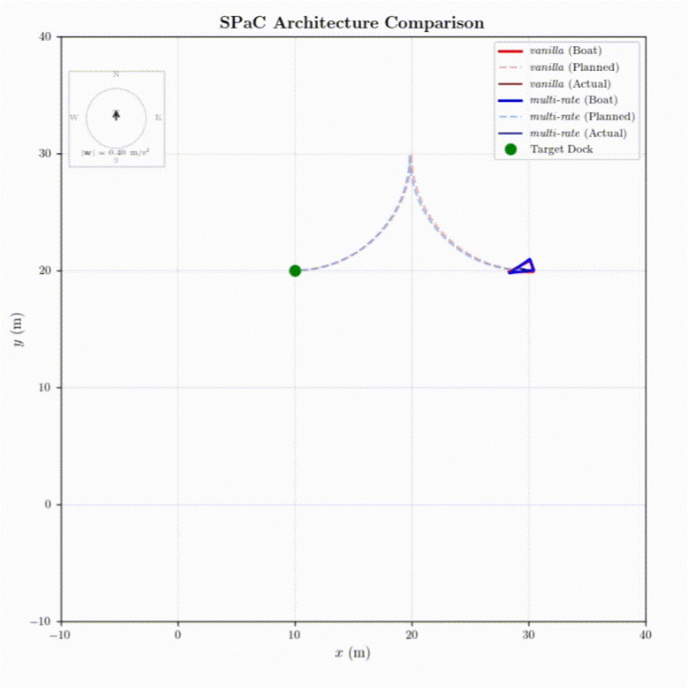

# Optimization for Docking an Autonomous Surface Vehicle in a Dynamic Environment



## Run Script

Simulate an optimization for one or more algorithms.

### Example usage
```
# Single method
python run.py -v

# Multiple methods compared side by side
python run.py -v -b -m

# With error plots
python run.py -v --plot
```

### Algorithm arguments
- `-v`: vanilla linear MPC
- `-n`: vanilla non-linear MPC
- `-b`: Bilevel optimization
- `-m`: Non-linear monolevel optimization

## Replay Script

Plays back the docking maneuver from a run in the data folder

### Example usage
```
# Single method
python replay.py --target_folder data/run_20260412_190813 -v

# Multiple methods compared side by side
python replay.py --target_folder data/run_20260412_190813 -v -b -m

# With custom playback speed and error plots
python replay.py --target_folder data/run_20260412_190813 -v --speed 3.0 --plot
```

### Algorithm arguments
Same as run script.
